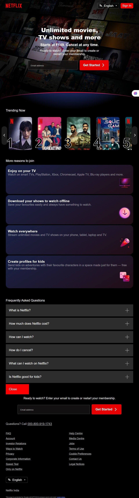

# 🚀 Netflix-Clone-Frontend

Netflix Frontend Clone  is a cloned  frontend  of Netflix India website .It consist of only the front web page of site .Created only using HTML CSS ,tried to give the same look as the original excepts some of teh javascript usecases . Good for fundamenetals of HTML CSS in frontend .


---

## 📌 Table of Contents
- [🚀 Netflix-Clone-Frontend](#-netflix-clone-frontend)
  - [📌 Table of Contents](#-table-of-contents)
  - [📖 About](#-about)
    - [✨ Features](#-features)
  - [⚙️ Installation](#️-installation)
  - [🖼 Screenshots](#-screenshots)
  - [🤝 Contributing](#-contributing)
  - [📜 License](#-license)
  - [📬 Contact](#-contact)


## 📖 About
A simple begineer friendly practice project for basics icluding HTML CSS concpts for flexbox , CSS grid , gradients , pseudo classes , css selectors etc along with some advanced concpets.
### ✨ Features
- It is simple
- Demonstration of how the complex designs are craeted using the basic HTML and CSS or desinging .
- Demonstrates the responsiveness of a webpage


## ⚙️ Installation
```bash
# 1. Clone the repository
git clone https://github.com/rajajainds/Netflix-Clone-Frontend.git

# 2. Navigate into the project folder
cd Netflix-Clone-Frontend

# 3. Run a server in this directory 
#           or
#   Move to this repo and open the path in browser
```

## 🖼 Screenshots

[Mobile View]


[Tablet View]



[Desktop View]


[Large-screens View]


## 🤝 Contributing

Contributions are welcome!

Follow these steps to contribute:

1.Fork this repository

2.Create a new branch (git checkout -b feature-branch)

3.Commit your changes (git commit -m 'Add new feature')

4.Push to the branch (git push origin feature-branch)

5.Open a Pull Request


## 📜 License

This project is licensed under the MIT License - see the LICENSE file for details.


## 📬 Contact

Raja Jain – rajajainds@gmail.com

GitHub: @rajajainds

LinkedIn: www.linkedin.com/in/rajajainds
